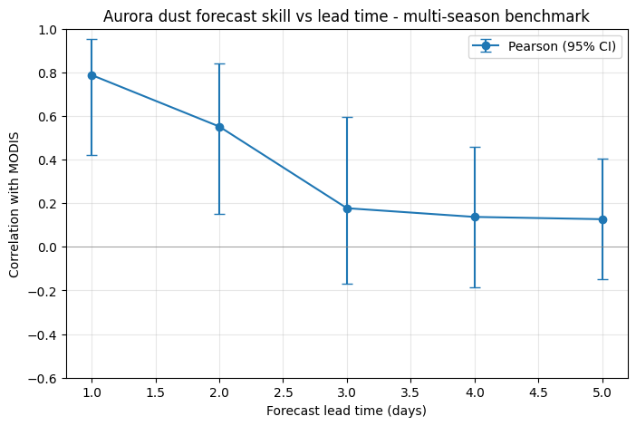
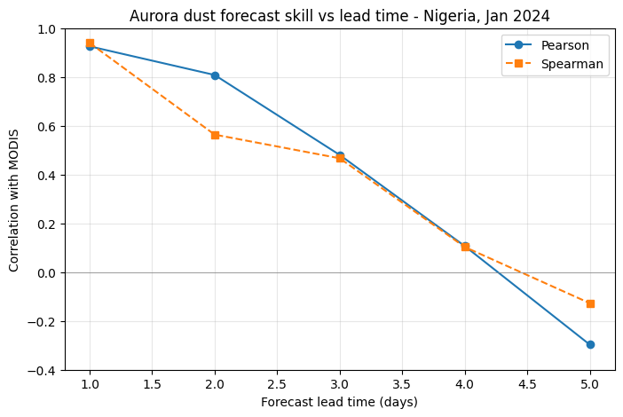
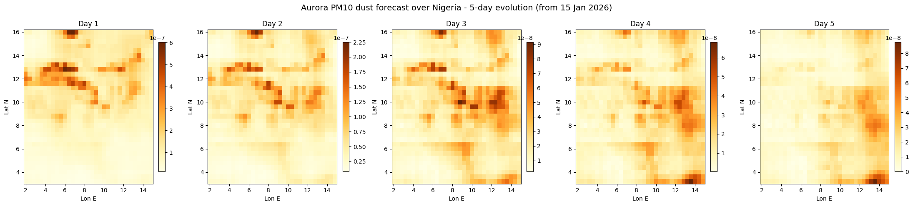
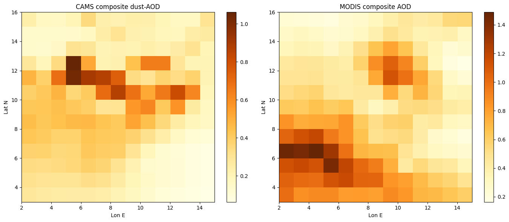

# Aurora Nigeria Dust — Harmattan Dust Forecasting and Validation

Evaluating whether the Aurora Earth-system foundation model can forecast
Harmattan dust over Nigeria with enough skill to support early warning.

## Summary

Using the pre-trained Aurora 0.4-degree air-pollution model (inference only),
this project forecasts dust (PM10) over Nigeria from CAMS input data and
validates the forecasts against independent satellite observations
(MODIS aerosol optical depth; Sentinel-5P Absorbing Aerosol Index).

Multi-season benchmark result (two Harmattan seasons, 2023/24 and 2024/25;
26 forecast dates): Aurora shows statistically significant dust-forecast skill
at 1-2 day lead - Day 1 Pearson r = 0.79 (95% CI 0.42-0.95), Day 2 r = 0.55
(95% CI 0.15-0.84) - with skill not distinguishable from zero beyond about
two days. At a 2-day lead the system detects 75% of dust events with a 25%
false-alarm ratio. This defines a useful early-warning horizon of about 1-2
days. Results are from a pilot benchmark (n = 26) with wide confidence
intervals that would tighten with a larger multi-season sample.

A single-season case study (January 2024, n = 10) gave a higher but
sample-fragile Day-1 correlation (~0.93); the multi-season benchmark above is
the robust, defensible result.

## Data sources

- CAMS global atmospheric-composition forecasts (Copernicus ADS) - model input and dust-AOD reference.
- Aurora checkpoint aurora-0.4-air-pollution.ckpt (Hugging Face microsoft/aurora). Weights are CC-BY-NC-SA (non-commercial).
- MODIS MOD04_L2 AOD (NASA Earthdata) - Dark Target / Deep Blue Combined product.
- Sentinel-5P Absorbing Aerosol Index (Google Earth Engine).

## Setup

1. Install dependencies: `pip install -r requirements.txt`.
2. Copernicus ADS: set env vars `CDSAPI_URL` and `CDSAPI_KEY` (get a free key from the ADS site).
3. NASA Earthdata: register at urs.earthdata.nasa.gov; first run calls an interactive login.
4. Google Earth Engine: register a project; set EE_PROJECT in src/config.py.
5. A GPU is required for Aurora inference (the region is cropped to Nigeria to fit free-tier GPUs).

## Usage

python run_case_study.py

This produces the forecast panels, the skill-vs-lead-time curve, and the
event-detection scores; figures are saved in figures/.

## Repository layout

- src/config.py - region, variables, grid constants
- src/credentials.py - safe credential handling (no keys in source)
- src/forecast.py - Aurora forecast pipeline
- src/satellite.py - Sentinel-5P AAI and MODIS AOD retrieval
- src/validation.py - regridding, spatial/temporal correlation, lead-time skill, event detection
- src/plots.py - figure generation (saves to figures/)
- run_case_study.py - end-to-end example

## Results

Multi-season benchmark (headline result). Aurora dust-forecast skill against MODIS
across two Harmattan seasons (26 dates), with 95% bootstrap confidence intervals.
Skill is significant at 1-2 day lead and decays to indistinguishable-from-zero by day 3+:

Single-season skill-vs-lead-time curve (January 2024 case study, for reference):

Example 5-day dust forecast evolution over Nigeria (15 January 2024 initialization),
showing the Harmattan plume building in the north and being transported over the region:

Validation reference: CAMS dust aerosol optical depth compared with MODIS Combined
aerosol optical depth over Nigeria (temporal composites, January 2024):

All figures are regenerated by running `python run_case_study.py`.

## Limitations

Preliminary single-season results (small sample). Aurora outputs surface
particulate matter while satellite references are column measures - an
acknowledged variable mismatch handled via regional/temporal framing. Satellite
retrieval over bright desert surfaces and polar-orbiter coverage gaps add
observational uncertainty; addressed via the Combined product, QA filtering,
and temporal compositing.

## Authorship and provenance

This repository was developed by Samson Adekoya, MSc Data and Information Science student at the University of Ibadan, as part of a research project evaluating AI-based Harmattan dust forecasting and early warning over Nigeria.

To the best of the author's knowledge, this is the first open, reproducible evaluation of the Aurora Earth-system foundation model for Harmattan dust forecasting over Nigeria. The repository contains the forecast pipeline, satellite-ingest modules, validation scripts, benchmark runner, and pilot benchmark results.

AI-assisted coding was used during development; the scientific design, methodological choices, validation decisions, interpretation, and documentation are the author's own.

## Citation and licence

Code released under the MIT licence (see LICENSE). The Aurora model weights are
licensed CC-BY-NC-SA (non-commercial) by Microsoft; respect that licence.
AI-assisted coding was used during development; scientific design and
interpretation are the author's own.

## Acknowledgements

Copernicus Atmosphere Monitoring Service (CAMS); NASA (MODIS, Earthdata);
ESA/Copernicus (Sentinel-5P); Microsoft Research (Aurora).
